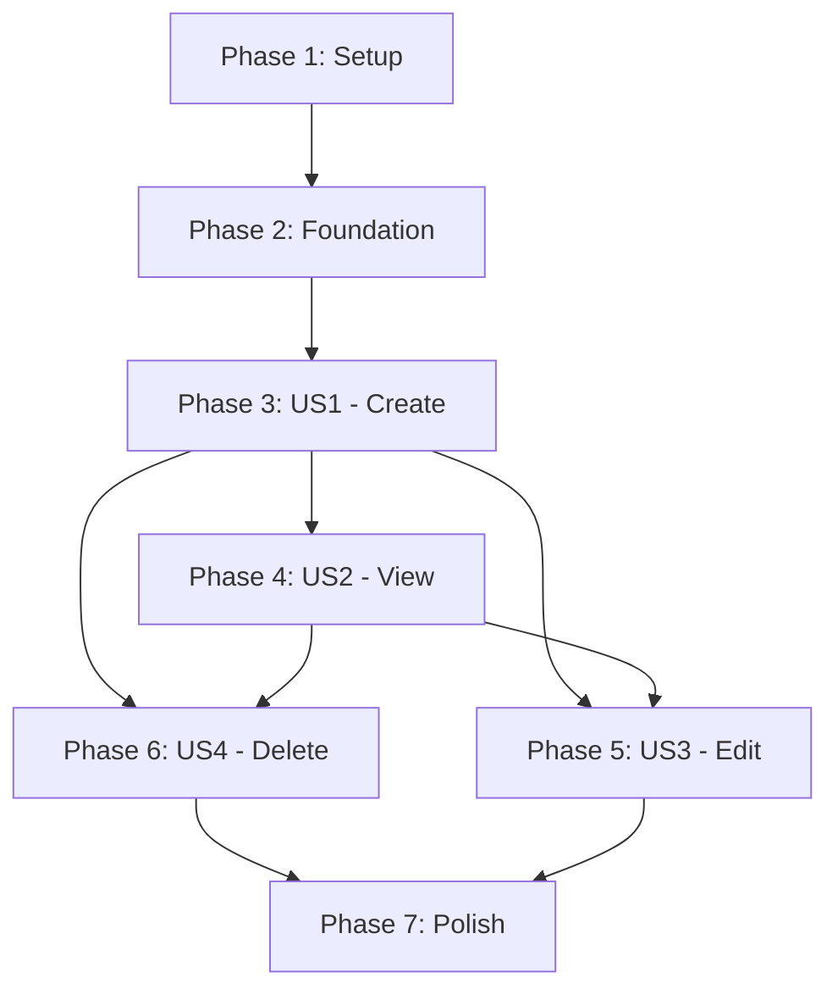

# Implementation Tasks: Core Collection Management

**Feature**: 001-collection-management
**Generated**: 2025-11-25
**Approach**: Test-Driven Development (TDD) - Red-Green-Refactor

## Overview

This feature implements foundational collection management for a vinyl record tracking application. Users can create, view, edit, and delete collections. This follows TDD principles with tests written before implementation.

**Tech Stack**: C# 14, .NET 10 SDK, .NET Aspire, Blazor Server, Entity Framework Core, ASP.NET Core Web API, TUnit, bUnit, Playwright, FluentAssertions

## User Stories (from spec)

1. **US1**: Create Collections - Users can create new collections with name, description, and item type (Priority: P1 - Foundation)
2. **US2**: View Collections - Users can list all their collections and view details (Priority: P2 - Core functionality)
3. **US3**: Edit Collections - Users can update collection name and description (Priority: P3 - Enhancement)
4. **US4**: Delete Collections - Users can remove collections (Priority: P4 - Cleanup)

## Implementation Strategy

- **MVP Scope**: US1 only (Create Collections) - Delivers immediate value
- **Incremental Delivery**: One user story per sprint, each independently testable
- **TDD Approach**: All tests written before implementation (Red-Green-Refactor)
- **Parallel Opportunities**: Tests can be written in parallel for different layers

---

## Phase 1: Project Setup

**Goal**: Initialize .NET Aspire solution with all required projects and dependencies

**Tasks**:

- [ ] T001 Create .NET Aspire solution with `dotnet new aspire` at repository root
- [ ] T002 [P] Create Domain project: `SuperDuperRescueHeads.Domain` (class library, .NET 10)
- [ ] T003 [P] Create Infrastructure project: `SuperDuperRescueHeads.Infrastructure` (class library, .NET 10)
- [ ] T004 [P] Create API project: `SuperDuperRescueHeads.Api` (webapi, .NET 10)
- [ ] T005 [P] Create Web project: `SuperDuperRescueHeads.Web` (blazor, .NET 10, Server interactivity)
- [ ] T006 [P] Create test project: `SuperDuperRescueHeads.Tests.Unit` (class library, .NET 10)
- [ ] T007 [P] Create test project: `SuperDuperRescueHeads.Tests.Integration` (class library, .NET 10)
- [ ] T008 [P] Create test project: `SuperDuperRescueHeads.Tests.UI` (class library, .NET 10)
- [ ] T009 [P] Create test project: `SuperDuperRescueHeads.Tests.E2E` (class library, .NET 10)
- [ ] T010 [P] Create test project: `SuperDuperRescueHeads.Tests.Contract` (class library, .NET 10)
- [ ] T011 Add project references: Infrastructure → Domain
- [ ] T012 Add project references: Api → Infrastructure, ServiceDefaults
- [ ] T013 Add project references: Web → Domain, ServiceDefaults
- [ ] T014 Add project references: AppHost → ServiceDefaults, Api, Web
- [ ] T015 [P] Install NuGet package: MediatR in Domain project
- [ ] T016 [P] Install NuGet packages: EF Core, EF Core SqlServer, EF Core Design, Identity.EntityFrameworkCore in Infrastructure
- [ ] T017 [P] Install NuGet packages: FluentValidation.AspNetCore, Serilog.AspNetCore, OpenTelemetry in Api
- [ ] T018 [P] Install NuGet packages: Serilog.AspNetCore in Web project
- [ ] T019 [P] Install NuGet packages: TUnit, FluentAssertions, NSubstitute, coverlet.collector in all test projects
- [ ] T020 [P] Install NuGet package: Microsoft.AspNetCore.Mvc.Testing in Integration tests
- [ ] T021 [P] Install NuGet package: bUnit in UI tests
- [ ] T022 [P] Install NuGet package: Microsoft.Playwright in E2E tests
- [ ] T023 Configure Aspire AppHost in `src/SuperDuperRescueHeads.AppHost/Program.cs` with SQL Server and projects
- [ ] T024 Configure Tailwind CSS in Web project with `tailwind.config.js` and build pipeline

---

## Phase 2: Foundational Components

**Goal**: Implement shared base classes and configuration needed by all user stories

**Tasks**:

- [ ] T025 [P] Create base Entity class in `src/SuperDuperRescueHeads.Domain/Common/Entity.cs` with domain events support
- [ ] T026 [P] Create base ValueObject class in `src/SuperDuperRescueHeads.Domain/Common/ValueObject.cs`
- [ ] T027 [P] Create base DomainEvent class in `src/SuperDuperRescueHeads.Domain/Common/DomainEvent.cs` implementing INotification
- [ ] T028 Create ApplicationDbContext in `src/SuperDuperRescueHeads.Infrastructure/Data/ApplicationDbContext.cs` extending IdentityDbContext
- [ ] T029 Configure ASP.NET Core Identity in ApplicationDbContext with User entity
- [ ] T030 Configure Serilog structured logging in Api `Program.cs`
- [ ] T031 Configure OpenTelemetry tracing in Api `Program.cs` with Aspire integration
- [ ] T032 Add authentication/authorization services in Api `Program.cs` with JWT bearer
- [ ] T033 Configure Blazor Server with authentication in Web `Program.cs`

---

## Phase 3: User Story 1 - Create Collections (MVP)

**Goal**: Users can create new collections with name, description, and item type

**Independent Test**: Create a collection with valid data, verify it persists with all attributes and appears in database

### Tests (TDD - Write First)

- [ ] T034 [P] [US1] Write unit test: CollectionName.Create with valid name succeeds in `tests/Unit/Domain/CollectionNameTests.cs`
- [ ] T035 [P] [US1] Write unit test: CollectionName.Create with empty name throws ArgumentException in `tests/Unit/Domain/CollectionNameTests.cs`
- [ ] T036 [P] [US1] Write unit test: CollectionName.Create with >100 chars throws ArgumentException in `tests/Unit/Domain/CollectionNameTests.cs`
- [ ] T037 [P] [US1] Write unit test: CollectionName.Create trims whitespace in `tests/Unit/Domain/CollectionNameTests.cs`
- [ ] T038 [P] [US1] Write unit test: ItemType.VinylRecord has correct id and name in `tests/Unit/Domain/ItemTypeTests.cs`
- [ ] T039 [P] [US1] Write unit test: ItemType.FromId with valid ID returns correct type in `tests/Unit/Domain/ItemTypeTests.cs`
- [ ] T040 [P] [US1] Write unit test: ItemType.FromId with invalid ID throws ArgumentException in `tests/Unit/Domain/ItemTypeTests.cs`
- [ ] T041 [P] [US1] Write unit test: Collection.Create with valid data succeeds in `tests/Unit/Domain/CollectionTests.cs`
- [ ] T042 [P] [US1] Write unit test: Collection.Create with invalid name throws exception in `tests/Unit/Domain/CollectionTests.cs`
- [ ] T043 [P] [US1] Write unit test: Collection.Create publishes CollectionCreatedEvent in `tests/Unit/Domain/CollectionTests.cs`
- [ ] T044 [P] [US1] Write integration test: CollectionRepository.AddAsync persists to database in `tests/Integration/Database/CollectionRepositoryTests.cs`
- [ ] T045 [P] [US1] Write integration test: Unique constraint prevents duplicate names per user in `tests/Integration/Database/CollectionRepositoryTests.cs`
- [ ] T046 [P] [US1] Write integration test: POST /collections creates collection in `tests/Integration/Api/CollectionsEndpointsTests.cs`
- [ ] T047 [P] [US1] Write integration test: POST /collections returns 409 for duplicate name in `tests/Integration/Api/CollectionsEndpointsTests.cs`
- [ ] T048 [P] [US1] Write integration test: POST /collections returns 409 when limit exceeded in `tests/Integration/Api/CollectionsEndpointsTests.cs`
- [ ] T049 [P] [US1] Write contract test: POST /collections matches OpenAPI spec in `tests/Contract/Endpoints/CollectionsApiContractTests.cs`
- [ ] T050 [P] [US1] Write UI test: CollectionForm component renders correctly in `tests/UI/Components/CollectionFormTests.cs`
- [ ] T051 [P] [US1] Write UI test: CollectionForm validates required fields in `tests/UI/Components/CollectionFormTests.cs`
- [ ] T052 [P] [US1] Write E2E test: User can create collection end-to-end in `tests/E2E/UserJourneys/CreateCollectionE2ETests.cs`

### Implementation (TDD - Make Tests Pass)

- [ ] T053 [US1] Implement CollectionName value object in `src/SuperDuperRescueHeads.Domain/Collections/CollectionName.cs`
- [ ] T054 [US1] Implement ItemType value object in `src/SuperDuperRescueHeads.Domain/Collections/ItemType.cs` with predefined types
- [ ] T055 [US1] Implement Collection aggregate root in `src/SuperDuperRescueHeads.Domain/Collections/Collection.cs` with Create factory method
- [ ] T056 [US1] Implement CollectionDomainEvents in `src/SuperDuperRescueHeads.Domain/Collections/CollectionDomainEvents.cs`
- [ ] T057 [US1] Create ICollectionRepository interface in `src/SuperDuperRescueHeads.Domain/Collections/ICollectionRepository.cs`
- [ ] T058 [US1] Implement CollectionConfiguration for EF Core in `src/SuperDuperRescueHeads.Infrastructure/Data/Configurations/CollectionConfiguration.cs`
- [ ] T059 [US1] Implement CollectionRepository in `src/SuperDuperRescueHeads.Infrastructure/Data/Repositories/CollectionRepository.cs`
- [ ] T060 [US1] Add Collections DbSet to ApplicationDbContext in `src/SuperDuperRescueHeads.Infrastructure/Data/ApplicationDbContext.cs`
- [ ] T061 [US1] Create EF Core migration: `dotnet ef migrations add InitialCreate`
- [ ] T062 [US1] Update database: `dotnet ef database update`
- [ ] T063 [US1] Create CreateCollectionRequest DTO in `src/SuperDuperRescueHeads.Api/Models/CreateCollectionRequest.cs`
- [ ] T064 [US1] Create CollectionResponse DTO in `src/SuperDuperRescueHeads.Api/Models/CollectionResponse.cs`
- [ ] T065 [US1] Create ItemTypeResponse DTO in `src/SuperDuperRescueHeads.Api/Models/ItemTypeResponse.cs`
- [ ] T066 [US1] Implement POST /collections endpoint in `src/SuperDuperRescueHeads.Api/Endpoints/CollectionsEndpoints.cs`
- [ ] T067 [US1] Add validation for collection limit (max 100) in POST endpoint
- [ ] T068 [US1] Add validation for duplicate name in POST endpoint
- [ ] T069 [US1] Register repository and endpoints in Api `Program.cs`
- [ ] T070 [US1] Create CollectionForm component in `src/SuperDuperRescueHeads.Web/Components/Shared/CollectionForm.razor`
- [ ] T071 [US1] Create Create.razor page in `src/SuperDuperRescueHeads.Web/Components/Pages/Collections/Create.razor`
- [ ] T072 [US1] Implement CollectionService.CreateCollectionAsync in `src/SuperDuperRescueHeads.Web/Services/CollectionService.cs`
- [ ] T073 [US1] Register CollectionService in Web `Program.cs`
- [ ] T074 [US1] Run all tests, verify 100% pass (TDD Green phase complete)

---

## Phase 4: User Story 2 - View Collections

**Goal**: Users can list all their collections and view individual collection details

**Independent Test**: Create multiple collections, list them with pagination, select one, verify details shown correctly

### Tests (TDD - Write First)

- [ ] T075 [P] [US2] Write integration test: CollectionRepository.GetByOwnerIdAsync returns user collections in `tests/Integration/Database/CollectionRepositoryTests.cs`
- [ ] T076 [P] [US2] Write integration test: CollectionRepository.GetByOwnerIdAsync supports pagination in `tests/Integration/Database/CollectionRepositoryTests.cs`
- [ ] T077 [P] [US2] Write integration test: CollectionRepository.GetByIdAsync retrieves by ID in `tests/Integration/Database/CollectionRepositoryTests.cs`
- [ ] T078 [P] [US2] Write integration test: GET /collections returns paginated list in `tests/Integration/Api/CollectionsEndpointsTests.cs`
- [ ] T079 [P] [US2] Write integration test: GET /collections/{id} returns collection details in `tests/Integration/Api/CollectionsEndpointsTests.cs`
- [ ] T080 [P] [US2] Write integration test: GET /collections/{id} returns 404 for non-existent in `tests/Integration/Api/CollectionsEndpointsTests.cs`
- [ ] T081 [P] [US2] Write integration test: GET /collections/{id} returns 403 for non-owner in `tests/Integration/Api/CollectionsEndpointsTests.cs`
- [ ] T082 [P] [US2] Write contract test: GET /collections matches OpenAPI spec in `tests/Contract/Endpoints/CollectionsApiContractTests.cs`
- [ ] T083 [P] [US2] Write UI test: CollectionCard component renders collection data in `tests/UI/Components/CollectionCardTests.cs`
- [ ] T084 [P] [US2] Write UI test: Collections Index page renders list in `tests/UI/Pages/CollectionsIndexTests.cs`
- [ ] T085 [P] [US2] Write E2E test: User can view collections list in `tests/E2E/UserJourneys/ViewCollectionsE2ETests.cs`

### Implementation (TDD - Make Tests Pass)

- [ ] T086 [US2] Implement GET /collections endpoint (list) in `src/SuperDuperRescueHeads.Api/Endpoints/CollectionsEndpoints.cs`
- [ ] T087 [US2] Implement GET /collections/{id} endpoint (detail) in `src/SuperDuperRescueHeads.Api/Endpoints/CollectionsEndpoints.cs`
- [ ] T088 [US2] Add authorization policy check (owner-only) in GET endpoints
- [ ] T089 [US2] Create CollectionCard component in `src/SuperDuperRescueHeads.Web/Components/Shared/CollectionCard.razor`
- [ ] T090 [US2] Create Index.razor page (list) in `src/SuperDuperRescueHeads.Web/Components/Pages/Collections/Index.razor`
- [ ] T091 [US2] Implement CollectionService.GetCollectionsAsync in `src/SuperDuperRescueHeads.Web/Services/CollectionService.cs`
- [ ] T092 [US2] Implement CollectionService.GetCollectionByIdAsync in `src/SuperDuperRescueHeads.Web/Services/CollectionService.cs`
- [ ] T093 [US2] Add pagination UI with Load More button in Index.razor
- [ ] T094 [US2] Run all tests, verify 100% pass

---

## Phase 5: User Story 3 - Edit Collections

**Goal**: Users can update collection name and description

**Independent Test**: Create collection, update name/description, verify changes persisted and events published

### Tests (TDD - Write First)

- [ ] T095 [P] [US3] Write unit test: Collection.UpdateName with valid name succeeds in `tests/Unit/Domain/CollectionTests.cs`
- [ ] T096 [P] [US3] Write unit test: Collection.UpdateName publishes CollectionNameChangedEvent in `tests/Unit/Domain/CollectionTests.cs`
- [ ] T097 [P] [US3] Write unit test: Collection.UpdateDescription succeeds in `tests/Unit/Domain/CollectionTests.cs`
- [ ] T098 [P] [US3] Write integration test: CollectionRepository.UpdateAsync persists changes in `tests/Integration/Database/CollectionRepositoryTests.cs`
- [ ] T099 [P] [US3] Write integration test: PUT /collections/{id} updates collection in `tests/Integration/Api/CollectionsEndpointsTests.cs`
- [ ] T100 [P] [US3] Write integration test: PUT /collections/{id} returns 409 for duplicate name in `tests/Integration/Api/CollectionsEndpointsTests.cs`
- [ ] T101 [P] [US3] Write contract test: PUT /collections/{id} matches OpenAPI spec in `tests/Contract/Endpoints/CollectionsApiContractTests.cs`
- [ ] T102 [P] [US3] Write UI test: Edit form pre-populates with existing data in `tests/UI/Pages/EditCollectionTests.cs`
- [ ] T103 [P] [US3] Write E2E test: User can edit collection in `tests/E2E/UserJourneys/EditCollectionE2ETests.cs`

### Implementation (TDD - Make Tests Pass)

- [ ] T104 [US3] Implement UpdateName method in Collection aggregate (`src/SuperDuperRescueHeads.Domain/Collections/Collection.cs`)
- [ ] T105 [US3] Implement UpdateDescription method in Collection aggregate (`src/SuperDuperRescueHeads.Domain/Collections/Collection.cs`)
- [ ] T106 [US3] Create UpdateCollectionRequest DTO in `src/SuperDuperRescueHeads.Api/Models/UpdateCollectionRequest.cs`
- [ ] T107 [US3] Implement PUT /collections/{id} endpoint in `src/SuperDuperRescueHeads.Api/Endpoints/CollectionsEndpoints.cs`
- [ ] T108 [US3] Add authorization check and duplicate name validation in PUT endpoint
- [ ] T109 [US3] Create Edit.razor page in `src/SuperDuperRescueHeads.Web/Components/Pages/Collections/Edit.razor`
- [ ] T110 [US3] Implement CollectionService.UpdateCollectionAsync in `src/SuperDuperRescueHeads.Web/Services/CollectionService.cs`
- [ ] T111 [US3] Reuse CollectionForm component in Edit page
- [ ] T112 [US3] Run all tests, verify 100% pass

---

## Phase 6: User Story 4 - Delete Collections

**Goal**: Users can remove collections they own

**Independent Test**: Create collection, delete it, verify removed from database and list

### Tests (TDD - Write First)

- [ ] T113 [P] [US4] Write unit test: Collection.CanBeDeletedBy returns true for owner in `tests/Unit/Domain/CollectionTests.cs`
- [ ] T114 [P] [US4] Write integration test: CollectionRepository.DeleteAsync removes collection in `tests/Integration/Database/CollectionRepositoryTests.cs`
- [ ] T115 [P] [US4] Write integration test: DELETE /collections/{id} deletes collection in `tests/Integration/Api/CollectionsEndpointsTests.cs`
- [ ] T116 [P] [US4] Write integration test: DELETE /collections/{id} returns 403 for non-owner in `tests/Integration/Api/CollectionsEndpointsTests.cs`
- [ ] T117 [P] [US4] Write contract test: DELETE /collections/{id} matches OpenAPI spec in `tests/Contract/Endpoints/CollectionsApiContractTests.cs`
- [ ] T118 [P] [US4] Write E2E test: User can delete collection with confirmation in `tests/E2E/UserJourneys/DeleteCollectionE2ETests.cs`

### Implementation (TDD - Make Tests Pass)

- [ ] T119 [US4] Implement DELETE /collections/{id} endpoint in `src/SuperDuperRescueHeads.Api/Endpoints/CollectionsEndpoints.cs`
- [ ] T120 [US4] Add authorization check (owner-only) in DELETE endpoint
- [ ] T121 [US4] Create Delete.razor page (confirmation) in `src/SuperDuperRescueHeads.Web/Components/Pages/Collections/Delete.razor`
- [ ] T122 [US4] Implement CollectionService.DeleteCollectionAsync in `src/SuperDuperRescueHeads.Web/Services/CollectionService.cs`
- [ ] T123 [US4] Add delete button to CollectionCard with confirmation modal
- [ ] T124 [US4] Run all tests, verify 100% pass

---

## Phase 7: Polish & Cross-Cutting Concerns

**Goal**: Add observability, error handling, performance optimizations, and documentation

### Tasks

- [ ] T125 [P] Add structured logging for all collection operations in CollectionRepository
- [ ] T126 [P] Add OpenTelemetry spans for repository operations
- [ ] T127 [P] Add health checks endpoint in Api `Program.cs`
- [ ] T128 [P] Configure Polly retry policies for database operations in Infrastructure
- [ ] T129 [P] Add API response compression in Api `Program.cs`
- [ ] T130 [P] Implement Problem Details (RFC 7807) error responses globally
- [ ] T131 [P] Add input validation with FluentValidation for all DTOs
- [ ] T132 [P] Configure WCAG 2.1 Level AA accessibility attributes in Blazor components
- [ ] T133 [P] Add loading indicators to all async operations in UI
- [ ] T134 [P] Add error boundaries and user-friendly error messages in Blazor
- [ ] T135 Run code coverage report with coverlet, verify ≥80% coverage
- [ ] T136 Run performance tests with BenchmarkDotNet for repository operations
- [ ] T137 Create C4 Context diagram in `/docs/architecture/c4-context.md`
- [ ] T138 Create C4 Container diagram in `/docs/architecture/c4-container.md`
- [ ] T139 Create DDD Bounded Context map in `/docs/architecture/ddd-context-map.md`
- [ ] T140 Update README.md with setup instructions and architecture overview

---

## Dependencies (User Story Completion Order)

**Notes**:
- US2, US3, US4 all depend on US1 (must be able to create before viewing/editing/deleting)
- US3 and US4 also depend on US2 (need to view to select item for edit/delete)
- US2, US3, US4 are otherwise independent after US1 is complete

---

## Parallel Execution Examples

### During US1 (Create Collections):

**Tests can be written in parallel** (all marked with [P]):
- Group A: Domain unit tests (T034-T043)
- Group B: Integration tests (T044-T048)
- Group C: Contract/UI/E2E tests (T049-T052)

**Implementation can follow** (after all tests written):
- Implement in layers: Domain → Infrastructure → API → UI

### Across User Stories:

Once US1 is implemented:
- **US2, US3, US4 tests** can all be written in parallel
- **US3 and US4 implementation** can proceed in parallel (different files, no conflicts)

---

## Summary

- **Total Tasks**: 140
- **Test Tasks**: 45 (TDD approach)
- **Implementation Tasks**: 95
- **Parallelizable Tasks**: 62 (marked with [P])
- **MVP Scope**: Phase 1 + Phase 2 + Phase 3 (US1 only) = 74 tasks
- **Estimated MVP Delivery**: 2-3 weeks with TDD
- **Full Feature Delivery**: 4-6 weeks

**Independent Test Criteria per User Story**:
- **US1**: Create collection → appears in database with all attributes
- **US2**: List collections → pagination works, details load correctly
- **US3**: Edit collection → changes persist, name uniqueness enforced
- **US4**: Delete collection → removed from database and UI

**Format Validation**: ✅ All tasks follow checklist format with Task ID, [P] marker for parallel, [Story] label for user story phases, and file paths included.
